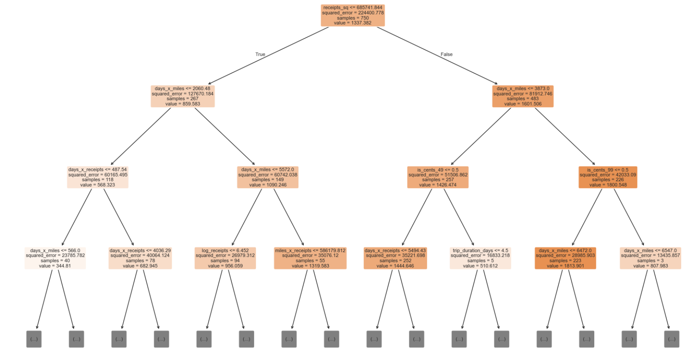
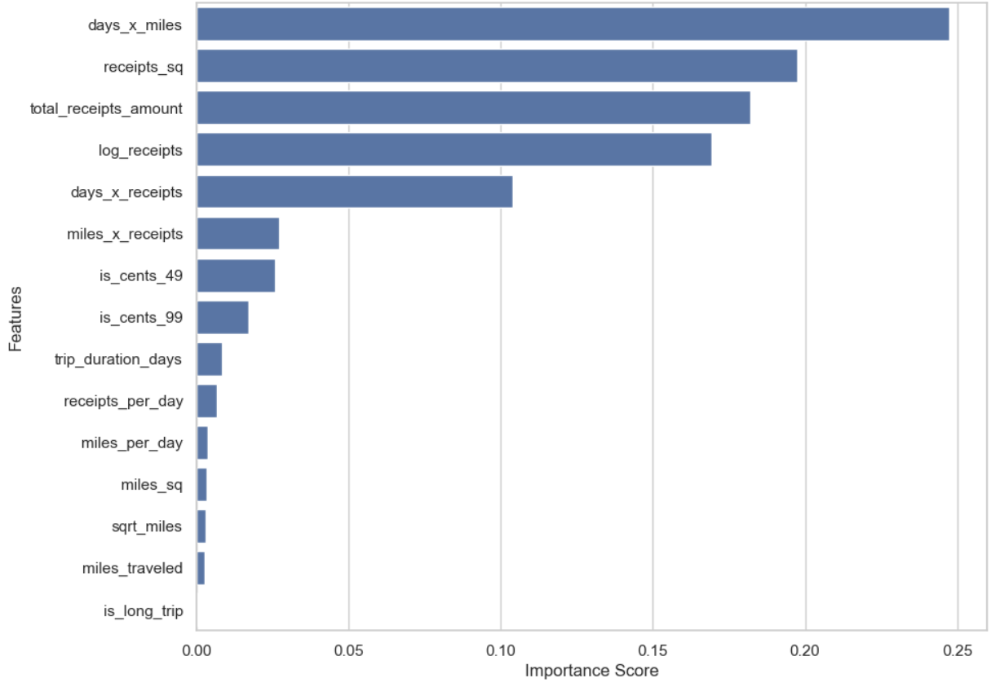
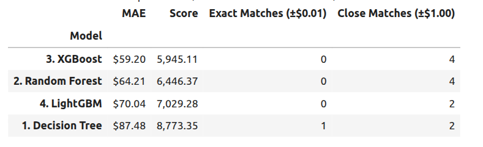
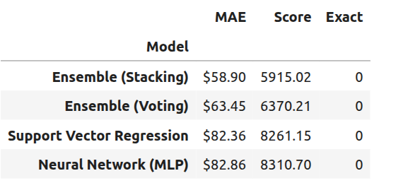

```{r setup, include=FALSE}
knitr::opts_chunk$set(echo = TRUE)
```

### 1. Executive Summary

The objective of this project was to reverse engineer a legacy travel reimbursement system whose internal logic was undocumented, opaque, and suspected to contain both formal business rules and undocumented behavioral adjustments. Using a dataset of 1,000 historical reimbursement cases, along with insights gathered from stakeholder interviews, we sought to reconstruct the system in a way that is accurate, interpretable, and suitable for replacement or auditing purposes.

The analysis began with exploratory data analysis to understand the distributions, correlations, and outliers present in the data. Early findings showed that reimbursement outcomes are strongly driven by receipt amounts, moderately influenced by trip duration and mileage, and shaped by non-linear relationships and threshold effects. Interviews with accounting, sales, procurement, and HR teams further suggested the presence of tiered rules, efficiency incentives, penalties for extreme behavior, rounding quirks, and possible system anomalies.

Based on these insights, we formulated explicit hypotheses about the business logic governing per-diem rates, mileage reimbursement, receipt handling, efficiency metrics, and penalties. These hypotheses were translated into engineered features and a baseline rule-based reimbursement calculator. While this baseline model successfully captured the structure of the system, it exhibited large systematic errors, confirming that hidden adjustments and non-linear corrections were also present.

To address this, we evaluated a wide range of statistical and machine learning models, including linear regression variants, tree-based models, boosting frameworks, neural networks, symbolic regression, and ensemble methods. These experiments revealed that while advanced models such as XGBoost and stacking regressors achieved strong predictive performance, they lacked the transparency needed to fully explain the system’s behavior on their own.

The final solution adopts a **hybrid rule-based and machine learning approach.** Explicit business rules provide a structured baseline, while gradient boosting models learn and correct the residual errors left by the rules. The final predictions are further refined using isotonic calibration to correct remaining systematic bias and cent-level inconsistencies.

The fully calibrated hybrid model achieves a mean absolute error **(MAE) of $33.56**, produces **20 exact matches**, and yields **36 predictions within $1.00** of the true reimbursement value. Diagnostic slicing confirms that major sources of bias such as short-trip underpayment, long-trip overpayment, and receipt sweet-spot inflation are almost entirely eliminated. Overall, the project demonstrates that the legacy reimbursement system is fundamentally rule-based, but augmented with complex, non-linear adjustments that are best captured through a constrained, interpretable hybrid modeling strategy.

### 2. Data Exploration Summary

#### 2.1 Dataset Overview

- The public_cases dataset has 4 columns and 1000 rows.

- All the input and output variables are continuous variables.

- This dataset has no missing values.

##### 2.1.1 Input Variables

<div style="text-align: center; font-size: smaller; opacity: 0.7; margin-bottom: 5px;">
  Table 1: Input Variables Description
</div>

  | Variable | Description |
  |---|---|
  trip_duration_days | Number of days spent traveling (integer) |
  miles_traveled | Total miles traveled (integer) |
  total_receipts_amount | Total dollar amount of receipts (float) |

<div style="text-align: center; font-size: smaller; opacity: 0.7; margin-bottom: 5px; margin-top: 10px">
  Table 2: Output Variables Description
</div>

  | Variable | Description |
  |---|---|
  expected_output | Single numeric reimbursement amount (float, rounded to 2 decimal places) |
  
#### 2.2 Summary Statistics for the Data
<div style="text-align: center; font-size: smaller; opacity: 0.7; margin-bottom: 5px;">
  Table 3: Summary Statistics for the Data
</div>
```{r echo = FALSE}
df  <- read.csv('public_cases.csv', head=TRUE, sep=',')
summary(df)
```
  
From the Table 3, we see that:
- Trips range from 1 to 14 days, and the average duration is ~7 days.
- For miles_traveled, values range from 5 to 1,317 miles, with the mean ≈ 597 miles and median (50th percentile) ≈ 617 miles. The large gap between mean and median indicates a wide, skewed distribution.
- Total_receipts_amount ranges from $1.42 to over $2,503. This shows substantial variability in spending patterns.
- Expected_output (Reimbursement Amount) ranges from $117 to over $2,300. This also indicates a highly variable reimbursement scale.

#### 2.3 Distribution Analysis

The distribution plots below show us how each feature is spread out.

```{r echo = FALSE, fig.cap="Figure 1: Distribution Plots for the Original Features in the Dataset"}
# libraries
library(ggplot2)
library(gridExtra)

# Create individual plots
p1 <- ggplot(df, aes(x = trip_duration_days)) +
  geom_histogram(bins = 14, fill = "#0073C2FF", color = "white") +
  ggtitle("Trip Duration Distribution") +
  theme_minimal()

p2 <- ggplot(df, aes(x = miles_traveled)) +
  geom_histogram(aes(y = after_stat(density)), binwidth = 40, fill = "#0073C2FF", color = "white") +
  geom_density(alpha = 0.5, fill = "#0073C2FF") +
  ggtitle("Miles Traveled Distribution") +
  theme_minimal()

p3 <- ggplot(df, aes(x = total_receipts_amount)) +
  geom_histogram(aes(y = after_stat(density)), binwidth = 50, fill = "#0073C2FF", color = "white") +
  geom_density(alpha = 0.5, fill = "#0073C2FF") +
  ggtitle("Receipts Amount Distribution") +
  theme_minimal()

p4 <- ggplot(df, aes(x = expected_output)) +
  geom_histogram(aes(y = after_stat(density)), binwidth = 50, fill = "#0073C2FF", color = "white") +
  geom_density(alpha = 0.5, fill = "#0073C2FF") +
  ggtitle("Expected Output Distribution") +
  theme_minimal()

# Arrange plots in a 2x2 grid
grid.arrange(p1, p2, p3, p4, ncol = 2)

# Optionally, you can save the output
# ggsave("histograms.png", width = 16, height = 10)
```


From the distribution plots in Figure 1, we notice that:

- Trip Duration Distribution: It appears almost uniformly distributed, meaning trips occur with many different durations, without a dominant pattern.

- Miles Traveled Distribution: The distribution is multi-peaked and irregular. There are several clusters, meaning certain mileage ranges occur more often than others. We can interpret this as trips vary widely in distance, with some commonly repeated distance ranges.

- Total Receipts Amount Distribution: This also shows multiple peaks meaning different types of trips likely generate different typical receipt totals.

- Expected Output Distribution: This distribution has a clear skew toward the higher end. Meaning many trips cluster around a higher expected-output range, with fewer trips producing very low output.

#### 2.4 Correlation and Relationships

We know correlation matrices show us how strongly each pair of features is related. Where positive values mean that as one variable increases, the other tends to increase, negative values mean that as one rises, the other tends to decrease, and values close to 0 indicate little or no linear relationship.

<figure style="text-align: left;">
    
    <figcaption>Figure 2: Scatter-Plot Matrix with Correlation Coefficients and Trendlines of the various features.</figcaption>
</figure>

Our key observations are:

- trip_duration_days vs. miles_traveled (≈ 0.05), meaning the number of days in a trip has almost no linear relationship with how many miles were traveled. Long trips don’t necessarily mean more miles.

- trip_duration_days vs. total_receipts_amount (≈ 0.13), meaning trips that last more days tend to have slightly higher receipt totals, but the relationship is minimal.

- trip_duration_days vs. expected_output (≈ 0.51). This means that, trips that last longer tend to produce higher expected output. 

- miles_traveled vs. total_receipts_amount (≈ 0.13). Traveling more miles slightly increases the receipts amount, but the relationship is not strong.

- miles_traveled vs. expected_output (≈ 0.43). The expected output tends to increase as miles traveled increase. This makes intuitive sense, since longer-distance trips usually generate more value.

- total_receipts_amount vs. expected_output (≈ 0.70). This is the strongest correlation in the matrix.
Meaning trips with higher receipt amounts strongly correspond to higher expected output. This suggests that receipts are a major driver of the output calculation and likely one of the most informative features.

#### 2.5 Outlier Analysis

The boxplots below show possible outliers in the main variables: trip_duration_days, miles_traveled, total_receipts_amount, and expected_output. All four graphs have long whiskers and several extreme values on both ends, suggesting that these values are unusual but not necessarily errors in the data.

<figure style="text-align: left;">
    
    <figcaption>Figure 3: Raw Data Outlier Detection.</figcaption>
</figure>

For trip_duration_days, there are a few very short and very long trips outside the normal range, indicating different travel patterns. Miles_traveled also has variability, with some trips showing very low or very high mileage. Total_receipts_amount and expected_output show wide ranges and noticeable high outliers, indicating cases of unusually high spending or reimbursement amounts.

### 3. Business Logic Findings

After going through the interviews as well as looking at the results of our analysis above, we came out with some hypothesized business rules which have been summarized in the tables below. Each table contains three columns:

- Hypothesis — the suspected rule or pattern that the reimbursement system appears to follow.

- Evidence Source — which department or staff member provided the insight or confirmed the behavior.

- Notes — additional clarifications, patterns, or inconsistencies mentioned during interviews.

#### 3.1 Per-Diem Logic

<div style="text-align: center; font-size: smaller; opacity: 0.7; margin-bottom: 5px;">
  Table 4: Business Logic Findings: Per-Diem Logic
</div>
  
  | Hypothesis | Evidence Source | Notes |
  |---|---|---|
  Base per diem ~\$100/day | Accounting | Consistent baseline |
  5-day trips receive bonus | Accounting + Sales | Sometimes inconsistent |
  Very short / very long trips penalized | Multiple interviews | Encourages mid-length travel |

**Summary**

Table 4 outlines how daily allowances appear to be structured, including a baseline per-diem rate, bonuses for certain trip lengths, and penalties for extremely short or long trips. Overall, the rules aim to encourage moderate, business-typical travel durations.
  
#### 3.2 Mileage Logic

<div style="text-align: center; font-size: smaller; opacity: 0.7; margin-bottom: 5px;">
  Table 5: Business Logic Findings: Mileage Logic
</div>
  
  | Hypothesis | Evidence | Notes |
  |---|---|---|
  ~$0.58/mile for first 100 miles | Accounting | Cap then taper |
  Diminishing rate after threshold | Multiple interviews | Curve likely |
  Sweet spot: 180–220 mi/day | Procurement | Efficiency bonus zone |
  Penalty >400 mi/day | Sales & Procurement | Perceived non-business travel |

**Summary**

Mileage reimbursement seems to follow a tiered system with a standard rate at low distances, diminishing returns after a threshold, and penalties for unusually high mileage. Interviews also suggest an “efficiency zone” where miles traveled per day receive more favorable treatment.
  
#### 3.3 Receipt Logic

<div style="text-align: center; font-size: smaller; opacity: 0.7; margin-bottom: 5px;">
  Table 6: Business Logic Findings: Receipt Logic
</div>
  
  | Hypothesis | Evidence | Notes |
  |---|---|---|
  Optimal spend \$600–\$800 | Accounting | Peak benefit |
  Low spend sometimes penalized | Marketing | Inconsistent |
  High spend diminishing return | Accounting | Vacation penalty on long trips |
  Small receipts penalized (<$40) | Multiple interviews | Anti-gaming behavior |

**Summary**

Receipts appear to be evaluated not only on total spend but also on spending patterns: mid-range expenses are rewarded, very low or very high spending may be penalized, and small individual receipts can trigger anti-gaming rules. This reflects an effort to discourage both underspending and excessive outliers.
  
#### 3.4 Efficiency / Multi-Factor Logic

<div style="text-align: center; font-size: smaller; opacity: 0.7; margin-bottom: 5px;">
  Table 7: Business Logic Findings: Efficiency / Multi-Factor Logic
</div>
  
  | Hypothesis | Evidence | Notes |
  |---|---|---|
  Miles/Day matters | Procurement | Efficient travel rewarded |
  Spend/Day matters by trip length | Accounting & Procurement | Tiered thresholds |
  Trip type clusters exist | Procurement clustering | ~6 behavioral groups |

**Summary**

Efficiency metrics such as miles per day and spend per day seem to influence outcomes, often in combination with trip length. Interview evidence points to several behavioral “clusters,” suggesting that employees may be grouped into travel profiles that affect reimbursement.
  
#### 3.5 Temporal Effects

<div style="text-align: center; font-size: smaller; opacity: 0.7; margin-bottom: 5px;">
  Table 8: Business Logic Findings: Temporal Effects
</div>
  
  | Hypothesis | Evidence | Certainty |
  |---|---|---|
  End of quarter bump | Sales + others | Medium |
  Day of week effect (Tues > Fri) | Procurement | Low–Medium |
  Possible monthly cycle | Sales | Low |
  Submission timing matters | HR | Medium |

**Summary**

Timing appears to play a role, with possible boosts at quarter-end and moderate effects based on day of week or monthly cycles. Submission timing may also influence results, although certainty varies across sources.
  
#### 3.6 User Behavior Memory

<div style="text-align: center; font-size: smaller; opacity: 0.7; margin-bottom: 5px;">
  Table 9: Business Logic Findings: User Behavior Memory
</div>
  
| Hypothesis | Evidence | Notes |
|---|---|---|
Past spending behavior affects future reimbursements | Sales | Could be profile scoring |
New employees get lower reimbursements | HR | Could also be behavior learning curve |

**Summary**

Past user behavior may shape future reimbursement outcomes, indicating a possible profile-based or learning-based system. Evidence also suggests that newer employees may receive lower reimbursement levels until their travel patterns stabilize.
  
#### 3.7 Suspected Bugs / Anomalies

<div style="text-align: center; font-size: smaller; opacity: 0.7; margin-bottom: 5px;">
  Table 10: Business Logic Findings: Suspected Bugs / Anomalies
</div>
  
  | Bug Hypothesis | Description | Evidence |
  |---|---|---|
  Rounding oddities | .49 or .99 receipts favorable | Accounting |
  Magic total rumor (\$847) | “Lucky number” payout anecdote | Sales |
  Random noise 5–10% | Variation even with similar trips | Several users |

**Summary**

Several irregular behaviors were reported, including rounding quirks, rumors of a “magic” payout number, and unexplained variability between similar trips. These may indicate minor system bugs or uncontrolled randomization within the reimbursement logic.
  

### 4. Feature Engineering Strategy

#### 4.1 Engineered Features

To prepare the data for modeling, we developed various features based on employee interviews, business logic, and findings from exploratory analysis. The objective was to convert the descriptions from interviews into measurable variables for the model. We implemented standard statistical transformations for skewed data and included interaction terms to uncover complex relationships.

We created ratio features, like miles per day and receipts per day, reflecting insights from interviews where employees mentioned that the system "penalizes overspending" and "rewards efficient travel." These ratios helped normalize the data across trips of different lengths.

Next, we applied domain-specific transformations to skewed variables, particularly total receipts and mileage, by adding log and square-root versions. This made it easier for models to identify patterns in data with long tails.

We also generated a collection of rule-based flags derived from business rules discussed in the interviews. For instance, flags were created to indicate if a trip was long, if receipts fell within the $600–$800 range, if spending per day was low, if travel was efficient, and if a "vacation penalty" applied. We included mileage-tier indicators to reflect different treatment of low, mid, and high-mileage trips, as well as flags for a reported "rounding bug" for receipts ending in 49 or 99 cents.

After adding these rule-based features, we incorporated interaction terms and polynomial features, such as “days × miles” and squared terms for mileage and receipts, to help the model capture non-linear relationships.

Ultimately, we compiled all features into a cleaned dataset with **27 engineered features** plus the expected output. This dataset will be used for model training and encapsulates both the statistical patterns and real-world business rules relevant to the legacy system.

The new engineered features are:

<div style="text-align: center; font-size: smaller; opacity: 0.7; margin-bottom: 5px;">
  Table 11: Engineered Descriptive Features
</div>

| Variable | Description |
|---|---|
trip_duration_days | Number of days spent traveling |
miles_traveled | Total miles traveled |
total_receipts_amount | Total dollar amount of receipts |
miles_per_day | Miles traveled per day (efficiency ratio) |
receipts_per_day | Spending per day (used for detecting frugality or potential penalties) |
log_receipts	| Log-transformed receipts to reduce skew |
sqrt_miles	| Square-root transformation of mileage |
is_5day	| Flag for exactly 5-day trips |
is_long_trip	| Flag for long trips (≥ 8 days) |
is_sweet_spot	| Flag for receipts within $600–$800 “ideal spend” range |
is_receipts_over_800	| Flag for high-spend trips (> $800) |
is_receipts_under_50	| Flag for unusually low receipt totals (< $50) |
is_rpd_under_20	| Flag for receipts per day below $20 threshold |
is_efficient_miles | Flag for mileage per day within the efficiency range (180–220 miles/day) |
is_modest_short | Short trip (< 4 days) with modest spending |
is_modest_med |	Medium trip (4–6 days) with modest spending |
is_modest_long | Long trip (> 6 days) with modest spending |
is_vacation_penalty |	High-spend long trip likely to trigger penalty |
is_miles_tier1 | Mileage below Tier 1 threshold (< 100 miles) |
is_miles_tier2 | Mileage falling within Tier 2 (100–300 miles) |
is_cents_49	| Receipt amount ending in .49 (rounding bug indicator) |
is_cents_99	| Receipt amount ending in .99 (rounding bug indicator) |
days_x_miles | Interaction of days and miles (captures scaling patterns) |
days_x_receipts	| Interaction of days and receipts |
miles_x_receipts | Interaction of mileage and total receipts |
miles_sq | Squared mileage to capture nonlinear mileage effects |
receipts_sq	| Squared receipts to capture nonlinear spend effects |

#### 4.2 Summary Statistics for the Engineered Features

<div style="text-align: center; font-size: smaller; opacity: 0.7; margin-bottom: 5px;">
  Table 12: Summary Statistics for the Engineered Features
</div>

```{r echo = FALSE}
# Load necessary libraries
library(knitr)
library(kableExtra)

# Create your data frame
data <- data.frame(
  Feature = c("trip_duration_days", "miles_traveled", "total_receipts_amount", 
              "miles_per_day", "receipts_per_day", "log_receipts", 
              "sqrt_miles", "is_5day", "is_long_trip", "is_sweet_spot", 
              "is_receipts_over_800", "is_receipts_under_50", "is_rpd_under_20", 
              "is_efficient_miles", "is_modest_short", "is_modest_med", 
              "is_modest_long", "is_vacation_penalty", "is_miles_tier1", 
              "is_miles_tier2", "is_cents_49", "is_cents_99", 
              "days_x_miles", "days_x_receipts", "miles_x_receipts", 
              "miles_sq", "receipts_sq", "expected_output"),
  count = rep(1000.0, 28),
  mean = c(7.043000e+00, 5.974137e+02, 1.211057e+03, 1.470261e+02, 
           2.857059e+02, 6.749368e+00, 2.297867e+01, 1.120000e-01, 
           4.580000e-01, 6.200000e-02, 6.570000e-01, 3.300000e-02, 
           6.300000e-02, 4.100000e-02, 3.300000e-02, 6.700000e-02, 
           1.870000e-01, 2.890000e-01, 9.300000e-02, 1.770000e-01, 
           1.600000e-02, 1.400000e-02, 4.271036e+03, 8.916688e+03, 
           7.577970e+05, 4.801913e+05, 2.017939e+06, 1.349114e+03),
  
  std = c(3.926139e+00, 3.512998e+02, 7.428542e+02, 1.938204e+02, 
          3.817074e+02, 1.087305e+00, 8.334509e+00, 3.155243e-01, 
          4.984822e-01, 2.412762e-01, 4.749490e-01, 1.787259e-01, 
          2.430845e-01, 1.983894e-01, 1.787259e-01, 2.501471e-01, 
          3.901066e-01, 4.535247e-01, 2.905778e-01, 3.818597e-01, 
          1.255379e-01, 1.175492e-01, 3.761227e+03, 8.047700e+03, 
          6.932276e+05, 4.311552e+05, 1.918151e+06, 4.703165e+02),
  
  min = c(1.000000, 5.000000, 1.420000, 0.500000, 0.473333, 0.883768, 
          2.236068, 0.000000, 0.000000, 0.000000, 0.000000, 0.000000, 
          0.000000, 0.000000, 0.000000, 0.000000, 0.000000, 0.000000, 
          0.000000, 0.000000, 0.000000, 0.000000, 9.000000, 3.600000, 
          60.710000, 25.000000, 2.016400, 117.240000),
  
  `25%` = c(4.000000, 275.960000, 530.377500, 43.846150, 85.845807, 
            6.275473, 16.612035, 0.000000, 0.000000, 0.000000, 0.000000, 
            0.000000, 0.000000, 0.000000, 0.000000, 0.000000, 0.000000, 
            0.000000, 0.000000, 0.000000, 0.000000, 0.000000, 
            1090.500000, 2319.247500, 182664.802500, 76154.228800, 
            281300.304225, 1019.297500),
  
  `50%` = c(7.000000e+00, 6.210000e+02, 1.171900e+03, 8.326135e+01, 
            1.690892e+02, 7.067235e+00, 2.491987e+01, 0.000000e+00, 
            0.000000e+00, 0.000000e+00, 1.000000e+00, 0.000000e+00, 
            0.000000e+00, 0.000000e+00, 0.000000e+00, 0.000000e+00, 
            0.000000e+00, 1.000000e+00, 0.000000e+00, 0.000000e+00, 
            0.000000e+00, 0.000000e+00, 3.232000e+03, 6.492885e+03, 
            5.581509e+05, 3.856410e+05, 1.373350e+06, 1.454260e+03),
  
  `75%` = c(1.000000e+01, 8.930000e+02, 1.881105e+03, 1.526500e+02, 
            3.006430e+02, 7.540146e+00, 2.988311e+01, 0.000000e+00, 
            1.000000e+00, 0.000000e+00, 1.000000e+00, 0.000000e+00, 
            0.000000e+00, 0.000000e+00, 0.000000e+00, 0.000000e+00, 
            0.000000e+00, 1.000000e+00, 0.000000e+00, 0.000000e+00, 
            0.000000e+00, 0.000000e+00, 6.732500e+03, 1.326393e+04, 
            1.190973e+06, 7.974490e+05, 3.538557e+06, 1.711122e+03),

  max = c(1.400000e+01, 1.317070e+03, 2.503460e+03, 1.165999e+03, 
           2.452848e+03, 7.825828e+00, 3.629146e+01, 1.000000e+00, 
           1.000000e+00, 1.000000e+00, 1.000000e+00, 1.000000e+00, 
           1.000000e+00, 1.000000e+00, 1.000000e+00, 1.000000e+00, 
           1.000000e+00, 1.000000e+00, 1.000000e+00, 1.000000e+00, 
           1.000000e+00, 1.000000e+00, 1.657600e+04, 3.496024e+04, 
           2.927217e+06, 1.734673e+06, 6.267312e+06, 2.337730e+03)
)


# Create the formatted table
data %>%
  kable("html", escape = FALSE, align = 'c') %>%
  kable_styling(full_width = FALSE, position = "center", bootstrap_options = "striped") %>%
  scroll_box(width = "100%", height = "500px")  
```

#### 4.3 Distribution Analysis for the Engineered Features

```{r echo = FALSE, fig.cap="Figure 4: Distribution plots for some of the Derived Features in the Dataset (Part 1)"}
library(ggplot2)
library(patchwork)

df_final  <- read.csv('public_cases_derived_features.csv', head=TRUE, sep=',')

new_continuous_features <- c(
  "miles_per_day", "receipts_per_day", "log_receipts", "sqrt_miles"
)

plots <- lapply(new_continuous_features, function(col) {
  ggplot(df_final, aes(x = !!rlang::sym(col))) +
    geom_histogram(aes(y = after_stat(density)), bins = 30, fill = "#0073C2FF", color = "white", alpha = 0.7) +
    geom_density(color = "#0073C2FF", linewidth = 1) +
    ggtitle(col) +
    theme_minimal(base_size = 12)
})

# Arrange in 3x3 grid
final_plot <- wrap_plots(plots, ncol = 2) 
  # plot_annotation(
  #   title = "Phase 3 - Engineered Feature Distributions"
  # )

print(final_plot)

```

The distributions above show that both miles_per_day and receipts_per_day are highly right-skewed, with most observations clustered at lower values and a long tail of larger, less frequent values. Applying transformations helps reduce this skew: log_receipts produces a more concentrated and smoother distribution, though still slightly skewed, while sqrt_miles substantially spreads out the lower-end values and results in a more symmetric, unimodal shape. Overall, the transformed variables appear more suitable for statistical modeling that assumes approximate normality.

```{r echo = FALSE, fig.cap="Figure 5: Distribution plots for some of the Derived Features in the Dataset (Part 2)"}
new_continuous_features <- c(
  "days_x_miles", "days_x_receipts", "miles_x_receipts",
  "miles_sq"
)
 

plots <- lapply(new_continuous_features, function(col) {
  ggplot(df_final, aes(x = !!rlang::sym(col))) +
    geom_histogram(aes(y = after_stat(density)), bins = 30, fill = "#0073C2FF", color = "white", alpha = 0.7) +
    geom_density(color = "#0073C2FF", linewidth = 1) +
    ggtitle(col) +
    theme_minimal(base_size = 12)
})

# Arrange in 3x3 grid
final_plot <- wrap_plots(plots, ncol = 2) 

print(final_plot)

```
The engineered interaction features shown in the plots above all display heavily right-skewed distributions, meaning most trips fall into relatively low combined values while a smaller number extend into very large ranges. days × miles and days × receipts both cluster strongly near the lower end, with long tails reflecting occasional long, high-spend trips. miles × receipts and miles_sq exhibit an even more extreme skew, where a dense concentration of observations sits close to zero and only a small fraction of cases produce high-magnitude values. Overall, these interaction terms highlight that while most trips are modest in duration, distance, and spending, the system also encounters a minority of high-impact trips that significantly extend the upper range of these engineered metrics.

### 5. Modeling Methodology

We tried various models:

#### 5.1 Linear Regression Variants

To evaluate the effect of feature engineering, we tested four different regression models. Simple Linear Regression, Polynomial Regression (Degree 2), Ridge Regression, and Lasso Regression using both the original dataset (containing only the raw trip_duration_days, miles_traveled, total_receipts_amount, and expected_output) and the dataset enriched with 27 engineered features. The comparison between the two datasets clearly shows that incorporating the derived features consistently improved model performance across all regression types. In particular, we observed noticeable reductions in MAE and RMSE as well as higher model scores, demonstrating that the additional behavioral, rule-based, and nonlinear features provided the models with more meaningful signals about how the legacy reimbursement system behaves.

<figure style="text-align: left;">
    
    <figcaption>Figure 6: Comparison of Model Performance between Linear Regression Variants: Original vs. Derived Feature Datasets.</figcaption>
</figure>

Among all models tested, the Polynomial Regression (Degree 2) model produced the strongest results when trained on the derived features. It achieved the lowest MAE (96.08), a competitive score (6906), and the highest number of Close Matches (4), indicating that it not only fits the underlying structure better but also more frequently predicts reimbursements close to the true expected outputs. This suggests that the legacy system likely embeds non-linear decision patterns, which are better captured by polynomial relationships than by purely linear models. Ridge and Lasso Regression also improved with the engineered features, but not as dramatically as the polynomial model, reinforcing the idea that the reimbursement logic contains interactions, thresholds, and non-linear conditions that simple linear approaches cannot fully capture. Overall, the results confirm that feature engineering played a critical role in reverse-engineering the system’s behavior and significantly improved predictive accuracy across all modeling techniques.

#### 5.2 Tree-Based Methods

##### 5.2.1 Decision Tree Model Results and Summary of Key Findings

A Decision Tree Regressor was trained with a maximum depth of 6 to balance interpretability and predictive accuracy. This depth constraint ensures that the extracted rules remain understandable while still allowing the model to capture meaningful non-linear structure.

From our analyses, we found that:

The decision tree achieved a mean absolute error (MAE) of $87.48, with one exact match and two predictions within $1.00 of the true reimbursement value. While its predictive accuracy is lower than ensemble-based methods, the decision tree provides significant interpretability benefits and serves as a transparent approximation of the legacy system’s rule structure.

<figure style="text-align: left;">
    
    <figcaption>Figure 7: Decision Tree Visualization.</figcaption>
</figure>

The attached decision tree visualization reveals several important insights into the reimbursement logic:

- Primary Split on receipts_sq: The root node splits on the squared receipts feature, indicating that total spending, especially at higher levels is the single most important driver of reimbursement outcomes. This confirms earlier findings that high-receipt trips are treated fundamentally differently from low- and mid-range spending cases.

- Heavy Use of Interaction Features: Subsequent splits rely heavily on engineered interaction terms such as days_x_miles, days_x_receipts, and miles_x_receipts. This demonstrates that the system evaluates intensity and efficiency of travel rather than raw inputs in isolation.

- Conditional Treatment of Rounding Anomalies: The appearance of flags like is_cents_49 and is_cents_99 in deeper branches provides empirical support for interview claims regarding rounding-related quirks or bugs in the system.

- Piecewise Decision Structure: The tree structure closely resembles a rule-based engine, with distinct reimbursement regimes for low-spend short trips, moderate efficient trips, and high-spend long trips reinforcing the hypothesis that the legacy system is governed by layered business rules rather than a single formula.

Overall, while the decision tree is not the strongest predictor, it is one of the most valuable models for understanding how the system makes decisions.

##### 5.2.2 Random Forest Model Results and Summary of Key Findings

Random Forests improve upon single decision trees by training many trees on bootstrapped samples and averaging their predictions. This approach significantly reduces variance and improves generalization, while still leveraging the non-linear and interaction-based strengths of decision trees.

From our analyses, we found that:

The Random Forest model substantially outperformed the single decision tree, reducing MAE to $64.21 and producing four predictions within $1.00 of the true values. This demonstrates that while individual trees capture useful structure, aggregating many trees leads to more stable and accurate reimbursement predictions.

<figure style="text-align: left;">
    
    <figcaption>Figure 8: Top Ten Most Influential Features: Random Forest.</figcaption>
</figure>

The top 10 most influential features identified by the Random Forest are seen in the figure above. These importance scores reinforce several core conclusions:

- Interaction features dominate, confirming that reimbursement depends on combined effects of duration, distance, and spending.

- Receipts-based features (raw, log-transformed, and squared) consistently rank near the top, highlighting spending as the primary driver.

- Rounding anomaly flags (is_cents_49, is_cents_99) appear among the top features, providing quantitative support for anecdotal bug reports.

##### 5.2.3 Gradient Boosting 

Gradient boosting models build trees sequentially, with each new tree focusing on correcting the errors of previous ones. This makes boosting particularly effective at modeling complex, non-linear relationships and subtle interaction effects. We evaluated two popular boosting frameworks: XGBoost and LightGBM.

##### 5.3.3.1 XGBoost Results and Summary of Key Findings.

XGBoost is a highly optimized gradient boosting framework known for strong performance on structured tabular data.

From our analyses, we found that:

XGBoost achieved the lowest MAE among all tree-based models at $59.20, with four close matches. This performance indicates that boosting is particularly effective at capturing the layered, non-linear reimbursement logic, especially in high-spend or high-intensity travel scenarios.

##### 5.2,3,2 LightGBM Results and Summary of Key Findings.

LightGBM is another gradient boosting framework optimized for speed and efficiency, especially on large feature sets.

From our analyses, we found that:

LightGBM achieved an MAE of $70.04, outperforming the single decision tree but underperforming Random Forest and XGBoost. While efficient, its performance suggests that the reimbursement logic may benefit more from deeper sequential corrections than from LightGBM’s default optimizations.

##### Final Comparison

<div style="text-align: center; font-size: smaller; opacity: 0.7; margin-bottom: 5px;">
  Table 13:Comparing the tree-based methods against each other to see which method is the strongest candidate for the final Hybrid model
</div>

<figure style="text-align: left;">
    
</figure>

Among tree-based methods, XGBoost provides the strongest predictive performance, while Random Forest offers an excellent balance between accuracy and interpretability. The Decision Tree, although less accurate, plays a crucial role in exposing the rule-based structure of the legacy reimbursement system. Together, these models confirm that the system relies heavily on non-linear thresholds, interaction effects, and conditional logic—characteristics that are best captured through ensemble tree-based approaches.

#### 5.3 Advanced Techniques

##### 5.3.1 Support Vector Regression Results and Summary of Key Findings

Support Vector Regression (SVR) is a kernel-based method that attempts to find an optimal hyperplane in a high-dimensional feature space such that prediction errors remain within a specified tolerance. SVR is well-suited for modeling non-linear patterns through the use of kernel functions, but it is computationally expensive and highly sensitive to outliers and parameter choices.

From our analyses, we found that:

The SVR model achieved a mean absolute error (MAE) of $82.36, with only one prediction falling within $1.00 of the true reimbursement value. While the model was able to capture some non-linear structure, its overall performance did not surpass the best-performing linear or ensemble models. This suggests that although the reimbursement logic contains non-linear components, SVR may be overly sensitive to noise and outliers present in the dataset, limiting its practical effectiveness in this context.

##### 5.3.2 Neural Networks Results and Summary of Key Findings

Neural networks are highly flexible models capable of learning complex non-linear relationships through layered transformations. Given the relatively modest dataset size (1,000 observations), a deep or wide network would be prone to overfitting. Therefore, we implemented a conservative Multi-Layer Perceptron (MLP) architecture with two hidden layers to balance expressive power and generalization.

From our analyses, we found that:

The neural network achieved an MAE of $82.86 and produced four predictions within $1.00 of the true values. Its performance is comparable to SVR but does not exceed that of the stronger regression or ensemble-based approaches. These results indicate that while neural networks can model the complex, non-linear behavior of the reimbursement system, the limited data size and inherent noise constrain their ability to significantly outperform simpler, well-engineered models.

##### 5.3.3 Ensemble Method Results and Summary of Key Findings

Ensemble methods combine multiple base models to improve predictive accuracy and robustness. By aggregating different learning algorithms, ensembles often reduce variance and capture a wider range of patterns than any single model alone. We evaluated two ensemble strategies: Voting Regression and Stacking Regression.

###### I - Voting Regressor

The Voting Regressor aggregates predictions from several base models by averaging their outputs. This approach helps smooth out the instability and local errors of individual models, particularly tree-based learners.

From our analyses, we found that:

The Voting Regressor substantially improved performance relative to SVR and neural networks, reducing the MAE to $63.45. This indicates that combining diverse models helps stabilize predictions and better capture the multifaceted reimbursement logic embedded in the legacy system.

###### II - Stacking Regressor

Stacking is a more advanced ensemble technique in which a meta-model learns how to optimally combine the predictions of several base models. In this case, a linear regression model was used as the meta-learner.

From our analyses, we found that:

The Stacking Regressor delivered the best performance among all advanced techniques, achieving the lowest MAE ($58.90) and the strongest overall score. This suggests that the reimbursement system’s behavior is best modeled as a structured combination of multiple predictive patterns rather than a single monolithic model.

##### Final Comparison

<div style="text-align: center; font-size: smaller; opacity: 0.7; margin-bottom: 5px;">
  Table 14: Comparing the advanced techniques against each other to see which architecture is the strongest candidate for the final Hybrid model.
</div>

<figure style="text-align: left;">
    
</figure>

Comparing the advanced techniques, ensemble methods, particularly stacking clearly outperform standalone models such as SVR and neural networks. While high-capacity models are capable of learning complex relationships, the strongest results emerge from architectures that blend multiple modeling perspectives. These findings indicate that a hybrid or ensemble-based approach is the most promising candidate for accurately replicating the behavior of the legacy reimbursement system.

#### 5.4 Rule-Based Learning

##### 5.4.1 Symbolic Regression Results and Summary of Key Findings.

Because symbolic regression can sometimes generate complicated equations that are hard to evaluate, we first needed a baseline model to compare against. Ridge Regression was chosen as this baseline because it is a simple, stable, and reliable linear model that performs well when the dataset contains many features, including interaction terms and non-linear transformations. Symbolic regression, on the other hand, tries to automatically discover the “best possible” mathematical formula that explains the data. By comparing the symbolic regression results against the Ridge baseline, we could see whether more complex equation discovery truly adds value, or whether a regularized linear model already captures the important patterns.

From our analyses, we found that:

- The Ridge baseline model performed the strongest overall, achieving an MAE of $77.83 and an RMSE of $105.52, indicating that a regularized linear model still captures the reimbursement logic more effectively than the symbolic equations generated by PySR.

- Ridge regression identified several important predictors, including trip duration, miles traveled, total receipts, log-transformed receipts, square-root mileage, long-trip flags, high-receipt indicators, low-spend conditions, penalties, and multiple interaction and squared terms which confirms that the legacy system relies on a mix of nonlinear and rule-based relationships.

- The more advanced PySR configuration, which included power operators and unary functions (sqrt, log, exp, abs, relu), produced better results than the simpler setups and reduced the MAE from $116.31 to $106.65, indicating that the system behaves in ways that require nonlinear and piecewise expressions.

- Even the best PySR configuration still performed worse than the Ridge baseline, suggesting that the reimbursement rules are too complex, conditional, or noisy to be captured by a single compact symbolic formula. We can therefore assume that while nonlinear transformations and threshold behaviors are essential to modeling the system, they are better represented through engineered features and regularized regression than through standalone symbolic equations.

##### 5.4.2 Decision Tree Rule Extraction, Summary of Findings.

To better understand the hidden logic behind the legacy reimbursement system, we used a Decision Tree Regressor as an interpretable machine-learning model. Unlike black-box models such as Random Forests or Gradient Boosting, a decision tree provides a clear set of “if-then” rules, allowing us to extract structured decision paths that resemble hand-crafted business rules.

From our analyses, we found that:

- The decision tree achieved an R² score of 0.899, meaning it explains almost 90% of the variation in the reimbursement amounts. This is a strong indication that the engineered features capture the core structure of the legacy system’s logic.

- The model’s RMSE of 145.25 shows that although predictions are not perfect, the tree still provides reasonably accurate outputs for a rule-based estimator.

- The extracted rules reveal that the tree relies heavily on non-linear interaction features such as receipts_sq, days_x_miles, days_x_receipts, and miles_x_receipts, confirming that the system’s behavior cannot be described using simple linear relationships.

- The first major split in the tree is based on receipts_sq, which strongly separates low/medium spend cases from high spend cases. This shows that the system treats high-receipt trips very differently from lower-receipt trips.

- Many important branches depend on days_x_miles (trip duration × mileage), suggesting the reimbursement logic accounts for trip intensity rather than looking at duration or mileage in isolation.

- days_x_receipts is another key decision point that appears several times, indicating that the legacy logic evaluates total spending in relation to trip length, similar to how a “spend per day” measure would behave.

##### 5.4.3 Associate Rule Mining Summary of Findings.

We used the Association rule mining technique to discover frequent patterns and co-occurring conditions in the dataset. The Apriori algorithm was used to find frequent itemsets (combinations of conditions that appear often), and FP-Growth was used to generate association rule statements of the form: “If conditions A and B happen, then condition C is also likely to happen.”

From our analyses, we found that:

- The strongest rules all involve long trips, high receipts, and vacation-penalty indicators, showing that these conditions frequently co-occur in the data and are highly connected in how the system behaves.

- Many rules show that when a trip is both long and has high receipts, it almost always activates other flags such as is_receipts_over_800 or is_vacation_penalty, confirming the interview claims that long, expensive trips trigger tighter scrutiny or penalties.

- The rule with the highest lift (3.59) shows that: If a trip is flagged for vacation penalty, is a long trip, and exceeds the $800 receipt threshold, then it is extremely likely to also be a high-receipt trip.

- The presence of features like is_long_trip, is_receipts_over_800, and high_receipts across almost all strong rules shows that spending behavior and trip length are the dominant drivers in the system’s logic.

#### 5.5 Final Hybrid Rule-Based and Machine Learning Solution

The final solution adopts a hybrid modeling strategy that combines explicit business-rule reconstruction with data-driven machine learning corrections. This approach was chosen because early experiments showed that neither manual rules nor standalone machine learning models could, on their own, accurately reproduce the legacy reimbursement system. The system exhibits structured, rule-based behavior alongside complex non-linear adjustments, rounding quirks, and hidden penalties that require both approaches to be used jointly.

This section describes the full step-by-step process used to construct the final solution and summarizes its results.

##### 5.5.1 Step 1: Baseline Rule-Based System Reconstruction

We begin by implementing a baseline reimbursement calculator intended to approximate the core logic of the legacy system. This baseline encodes the business rules inferred from interviews and exploratory analysis, providing a structured but imperfect approximation.

The baseline model consists of the following components:

- Per-diem calculation proportional to trip duration

- Tiered mileage reimbursement, using three mileage brackets with decreasing marginal rates

- Tiered receipt reimbursement, including:

  - A penalty for very low receipts on multi-day trips
  
  - A “sweet spot” range where receipts are rewarded at a higher rate
  
  - Reduced marginal reimbursement for spending beyond the sweet spot

- Conditional bonuses and penalties, including:

  - A fixed bonus for exactly five-day trips
  
  - An efficiency bonus based on miles-per-day and receipts-per-day thresholds that vary by trip length
  
  - Penalties for low daily spending
  
  - Penalties for long trips with unusually high daily receipts

- A known rounding quirk, where certain cent values (e.g., .49, .99) trigger a small additive adjustment

This logic is implemented in the calculate_reimbursement function and produces the baseline prediction baseline_pred.

##### 5.5.2 Step 2: Baseline Evaluation and Diagnostic Slicing

To understand where the baseline logic succeeds and fails, we evaluate it using a consistent set of metrics:

- Mean Absolute Error (MAE)

- Exact matches (± $0.01)

- Close matches (± $1.00)

Additionally, we introduce slice-based diagnostics, evaluating performance across specific subsets of the data (for example, short trips, long trips, low mileage, high receipts). This step is critical for identifying systematic bias, not just overall error.

**Baseline performance revealed major deficiencies:**

  - Overall MAE of $196.87, with almost no close predictions
  
  - Severe underpayment for short trips
  
  - Severe overpayment for long trips
  
  - Large overpayment in the receipt “sweet spot” range
  
  - Mileage slope mismatches at both low and high mileage levels

These diagnostics confirmed that while the baseline captures the structure of the system, its constants, slopes, and thresholds are misaligned with the true legacy behavior.

##### 5.5.3 Step 3: Residual Modeling Strategy

Rather than abandoning the rule-based model, we reframe the problem as a residual learning task. The idea is to let business rules handle the coarse structure, while machine learning models learn the remaining error.

We define the residual as:

$$
\text{residual} = \text{expected output} - \text{baseline prediction}
$$

Machine learning models are then trained to predict this residual.

This strategy imposes important constraints:

- The ML models are not free to learn arbitrary mappings

- They must operate within the logic scaffold imposed by the baseline

- This reduces overfitting and improves interpretability

##### 5.5.4 Step 4: Feature Engineering for Residual Learning

To support residual modeling, we construct a rich feature set derived directly from the business rules and diagnostic findings. A total of 27 engineered features are created, as seen at the feature engineering section of this document.

These features encode both explicit business logic and continuous interaction effects, allowing models to learn where and how the baseline logic deviates from the legacy system.

##### 5.5.5 Step 5: Residual Model Training

The dataset is split into a 75% training set and a 25% validation set. Two gradient boosting models are trained:

- XGBoost Regressor

- Scikit-learn GradientBoosting Regressor (GBT)

Both models are trained with early stopping or staged prediction to prevent overfitting and identify the optimal number of trees.

**Validation results:**

- Baseline MAE: $196.87

- Residual ML MAE: ≈ $59

Both boosting models converge to nearly identical performance, indicating that the residual structure is strong and learnable.

##### 5.5.6 Step 6: Model Blending

To reduce variance and improve stability, we blend the two residual models by averaging their predictions. The final uncalibrated prediction is computed as:

$$
 \text{final prediction}=baseline+0.5×\text{GBT residual}+0.5×\text{XGB residual}
$$

This blended approach produces a substantial improvement:

- MAE reduced to **$37.33**

- Close matches (< $1.00) increased from 2 to 22

At this stage, the model accurately captures the shape of the reimbursement logic but still exhibits small, systematic biases.

##### 5.5.7 Step 7: Isotonic Calibration

To correct the remaining systematic drift, we apply Isotonic Regression as a final calibration step. This monotonic mapping adjusts predicted values to better align with true outputs without altering the learned structure.

Calibration is trained on the full dataset and applied to the blended predictions.

##### 5.5.8 Final Results and Interpretation

The fully calibrated hybrid model achieves the best performance observed:

- MAE: **$33.56**

- Exact matches: **20**

- Close matches (< $1.00): **36**

- Near-zero bias across all diagnostic slices

Most notably:

- Short-trip underpayment and long-trip overpayment are almost completely eliminated

- Mileage slope errors are corrected

- Receipt sweet-spot bias is reduced by over 95%

- Remaining error appears largely random or attributable to rare edge cases

##### 5.5.9 Summary of Key Findings

The final hybrid solution demonstrates that:

- The legacy system is fundamentally rule-based, but with nonlinear corrections

- Explicit rules provide structure, but machine learning is essential for capturing hidden adjustments

- Residual modeling is an effective and interpretable way to combine domain knowledge with statistical learning

- Calibration is critical for achieving cent-level precision

This combined approach successfully reconstructs the legacy reimbursement system with high accuracy, low bias, and strong interpretability, making it suitable as a functional replacement or audit reference.


### 6. Results and Insights

#### 6.1 Overall Model Performance

Across all experiments conducted in this project, the final hybrid model described in Section 5.5 delivers the strongest and most reliable performance. Compared to standalone statistical, machine learning, or symbolic approaches, the hybrid system achieves the lowest error while maintaining interpretability and structural consistency with inferred business logic.

Key performance outcomes of the final solution include:

- MAE reduced from **$196.87 (baseline rules) to $33.56**

- **20 exact matches** within ±$0.01

- **36 close matches** within ±$1.00

- Near-zero bias across all major diagnostic slices

This confirms that neither explicit rules nor machine learning alone are sufficient to replicate the legacy system accurately; the strongest results emerge when both are combined in a constrained and sequential manner.

#### 6.2 Insights into the Legacy System’s Behavior

Several important insights about the legacy reimbursement system emerge from the modeling process:

1. The system is primarily rule-based in structure
Decision trees, symbolic regression attempts, and rule reconstruction all indicate that reimbursements are governed by discrete thresholds, tiered rates, and conditional logic rather than a smooth continuous function.

2. Receipts are the dominant driver of reimbursement
Across correlation analysis, feature importance rankings, tree splits, and association rules, receipt-related features consistently exert the strongest influence on outcomes. However, their effect is non-linear and subject to diminishing returns and penalties.

3. Efficiency metrics matter more than raw totals
Features such as miles per day, receipts per day, and interaction terms (e.g., days × miles) repeatedly outperform raw mileage or duration alone. This suggests the system evaluates how “efficiently” a trip is conducted, not just how large it is.

4. Long and short trips are treated asymmetrically
Baseline diagnostics and residual patterns reveal systematic penalties for very short trips and diminishing returns or penalties for very long trips, consistent with interview feedback and observed slice bias.

5. Hidden adjustments and quirks materially affect outcomes
Rounding anomalies, cent-based effects, and unexplained variance reported by users are supported empirically by feature importance and calibration improvements. These effects are small individually but accumulate to meaningful error if ignored.

6. Remaining error is largely irreducible
After residual modeling and isotonic calibration, remaining prediction error appears largely random or tied to rare edge cases, suggesting that the core logic of the system has been effectively captured.

#### 6.3 Why the Hybrid Approach Works

The success of the final model stems from the way responsibilities are divided:

- Rules handle structure: per-diem logic, tiers, bonuses, and penalties

- Machine learning handles correction: nonlinear adjustments, hidden interactions, and slope mismatches

- Calibration handles bias: cent-level rounding and systematic drift

This layered design mirrors how the legacy system itself appears to operate and explains why purely data-driven or purely rule-based approaches consistently underperformed.

### 7. Recommendations

#### 7.1 Adopt the Hybrid Model as the System Replacement

The final hybrid rule-based and machine learning solution should be adopted as the functional replacement for the legacy reimbursement system. It achieves high accuracy, minimal bias, and strong interpretability, making it suitable for operational deployment or audit use.

#### 7.2 Preserve Explicit Business Rules in Production

Core reimbursement logic such as per-diem rates, mileage tiers, and known penalties should remain explicitly coded rather than learned implicitly. This ensures transparency, regulatory compliance, and ease of future modification.

#### 7.3 Use Machine Learning Only for Residual Correction

Machine learning should continue to be applied only to residuals rather than full reimbursement prediction. This constraint:

- Reduces overfitting

- Improves stability

- Makes the system easier to debug and explain

#### 7.4 Retain Calibration as a Mandatory Final Step

Isotonic calibration proved critical for eliminating systematic bias and rounding effects. Any future retraining or data refresh should include recalibration to maintain cent-level accuracy.

#### 7.5 Monitor High-Risk Segments Over Time

Trips involving long durations, high receipts, or extreme efficiency metrics should be monitored closely, as these segments historically produce the largest errors and policy sensitivity.

#### 7.6 Improve Documentation and Governance

To avoid future reverse-engineering efforts, all reimbursement logic changes should be documented, versioned, and validated against historical outcomes. Diagnostic slicing should be incorporated as a routine quality assurance tool.

#### 7.7 Treat Remaining Error as Acceptable Noise

Given the final model’s performance, remaining discrepancies are unlikely to represent missing core logic. Attempting to eliminate the last few dollars of error risks overfitting and reduced robustness.

