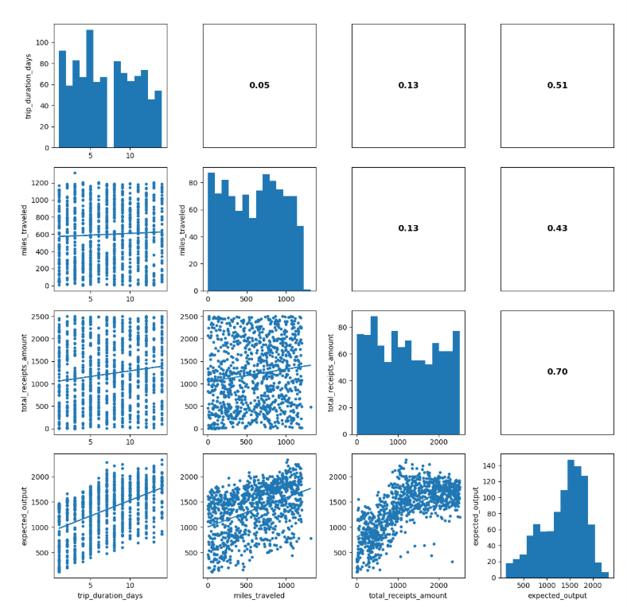
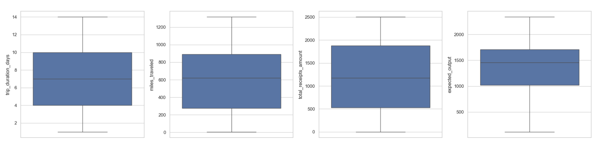
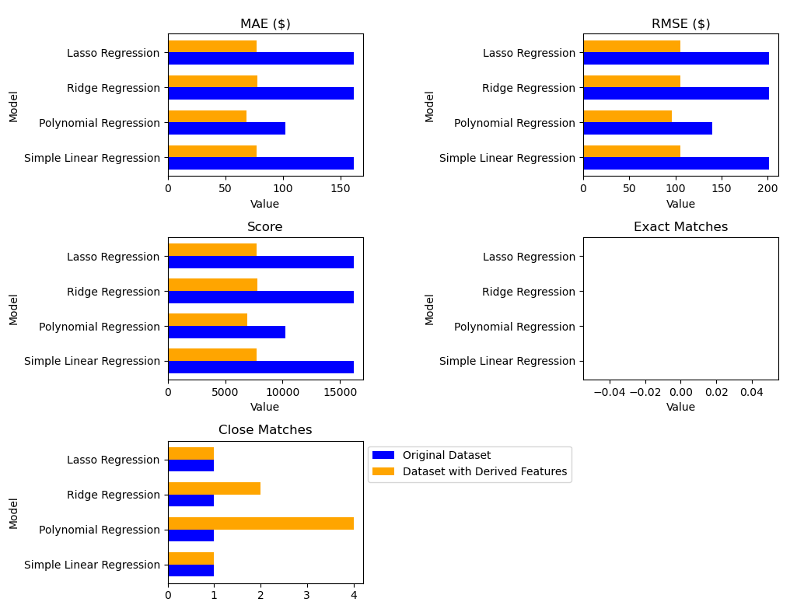

```{r setup, include=FALSE}
knitr::opts_chunk$set(echo = TRUE)
```

### 1. Executive Summary
Purpose of the reverse engineering project

Overview of the data

High-level approach

Critical patterns discovered

Key business logic inferred

Main model insights

Recommendations for system improvement

### 2. Data Exploration Summary

#### 2.1 Dataset Overview

- The public_cases dataset has 4 columns and 1000 rows.

- All the input and output variables are continuous variables.

- This dataset has no missing values.

##### 2.1.1 Input Variables

  | Variable | Description |
  |---|---|
  trip_duration_days | Number of days spent traveling (integer) |
  miles_traveled | Total miles traveled (integer) |
  total_receipts_amount | Total dollar amount of receipts (float) |
  
##### 1.1.1 Output Variables

  | Variable | Description |
  |---|---|
  expected_output | Single numeric reimbursement amount (float, rounded to 2 decimal places) |
  
#### 2.2 Summary Statistics for the Data
```{r echo = FALSE}
df  <- read.csv('public_cases.csv', head=TRUE, sep=',')
summary(df)
```
  
From the table above, we see that:
- Trips range from 1 to 14 days, and the average duration is ~7 days.
- For miles_traveled, values range from 5 to 1,317 miles, with the mean ≈ 597 miles and median (50th percentile) ≈ 617 miles. The large gap between mean and median indicates a wide, skewed distribution.
- Total_receipts_amount ranges from $1.42 to over $2,503. This shows substantial variability in spending patterns.
- Expected_output (Reimbursement Amount) ranges from $117 to over $2,300. This also indicates a highly variable reimbursement scale.

#### 2.3 Distribution Analysis

The distribution plots below show us how each feature is spread out.

```{r echo = FALSE}
# libraries
library(ggplot2)
library(gridExtra)

# Create individual plots
p1 <- ggplot(df, aes(x = trip_duration_days)) +
  geom_histogram(bins = 14, fill = "#0073C2FF", color = "white") +
  ggtitle("Trip Duration Distribution") +
  theme_minimal()

p2 <- ggplot(df, aes(x = miles_traveled)) +
  geom_histogram(aes(y = after_stat(density)), binwidth = 40, fill = "#0073C2FF", color = "white") +
  geom_density(alpha = 0.5, fill = "#0073C2FF") +
  ggtitle("Miles Traveled Distribution") +
  theme_minimal()

p3 <- ggplot(df, aes(x = total_receipts_amount)) +
  geom_histogram(aes(y = after_stat(density)), binwidth = 50, fill = "#0073C2FF", color = "white") +
  geom_density(alpha = 0.5, fill = "#0073C2FF") +
  ggtitle("Receipts Amount Distribution") +
  theme_minimal()

p4 <- ggplot(df, aes(x = expected_output)) +
  geom_histogram(aes(y = after_stat(density)), binwidth = 50, fill = "#0073C2FF", color = "white") +
  geom_density(alpha = 0.5, fill = "#0073C2FF") +
  ggtitle("Expected Output Distribution") +
  theme_minimal()

# Arrange plots in a 2x2 grid
grid.arrange(p1, p2, p3, p4, ncol = 2)

# Optionally, you can save the output
# ggsave("histograms.png", width = 16, height = 10)
```

From the distribution plots above, we notice that:

- Trip Duration Distribution: It appears almost uniformly distributed, meaning trips occur with many different durations, without a dominant pattern.

- Miles Traveled Distribution: The distribution is multi-peaked and irregular. There are several clusters, meaning certain mileage ranges occur more often than others. We can interpret this as trips vary widely in distance, with some commonly repeated distance ranges.

- Total Receipts Amount Distribution: This also shows multiple peaks meaning different types of trips likely generate different typical receipt totals.

- Expected Output Distribution: This distribution has a clear skew toward the higher end. Meaning many trips cluster around a higher expected-output range, with fewer trips producing very low output.

#### 2.4 Correlation and Relationships

We know correlation matrices show us how strongly each pair of features is related. Where positive values mean that as one variable increases, the other tends to increase, negative values mean that as one rises, the other tends to decrease, and values close to 0 indicate little or no linear relationship.

<figure style="text-align: left;">
    
    <figcaption>Figure 2: Scatter-Plot Matrix with Correlation Coefficients and Trendlines of the various features.</figcaption>
</figure>

Our key observations are:

- trip_duration_days vs. miles_traveled (≈ 0.05), meaning the number of days in a trip has almost no linear relationship with how many miles were traveled. Long trips don’t necessarily mean more miles.

- trip_duration_days vs. total_receipts_amount (≈ 0.13), meaning trips that last more days tend to have slightly higher receipt totals, but the relationship is minimal.

- trip_duration_days vs. expected_output (≈ 0.51). This means that, trips that last longer tend to produce higher expected output. 

- miles_traveled vs. total_receipts_amount (≈ 0.13). Traveling more miles slightly increases the receipts amount, but the relationship is not strong.

- miles_traveled vs. expected_output (≈ 0.43). The expected output tends to increase as miles traveled increase. This makes intuitive sense, since longer-distance trips usually generate more value.

- total_receipts_amount vs. expected_output (≈ 0.70). This is the strongest correlation in the matrix.
Meaning trips with higher receipt amounts strongly correspond to higher expected output. This suggests that receipts are a major driver of the output calculation and likely one of the most informative features.

#### 2.5 Outlier Analysis

The boxplots below show possible outliers in the main variables: trip_duration_days, miles_traveled, total_receipts_amount, and expected_output. All four graphs have long whiskers and several extreme values on both ends, suggesting that these values are unusual but not necessarily errors in the data.

<figure style="text-align: left;">
    
    <figcaption>Figure 3: Raw Data Outlier Detection.</figcaption>
</figure>

For trip_duration_days, there are a few very short and very long trips outside the normal range, indicating different travel patterns. Miles_traveled also has variability, with some trips showing very low or very high mileage. Total_receipts_amount and expected_output show wide ranges and noticeable high outliers, indicating cases of unusually high spending or reimbursement amounts.

### 3. Business Logic Findings

After going through the interviews as well as looking at the results of our analysis above, we came out with some hypothesized business rules which have been summarized in the tables below. Each table contains three columns:

- Hypothesis — the suspected rule or pattern that the reimbursement system appears to follow.

- Evidence Source — which department or staff member provided the insight or confirmed the behavior.

- Notes — additional clarifications, patterns, or inconsistencies mentioned during interviews.

#### 3.1 Per-Diem Logic
  
  | Hypothesis | Evidence Source | Notes |
  |---|---|---|
  Base per diem ~\$100/day | Accounting | Consistent baseline |
  5-day trips receive bonus | Accounting + Sales | Sometimes inconsistent |
  Very short / very long trips penalized | Multiple interviews | Encourages mid-length travel |

**Summary**

This table outlines how daily allowances appear to be structured, including a baseline per-diem rate, bonuses for certain trip lengths, and penalties for extremely short or long trips. Overall, the rules aim to encourage moderate, business-typical travel durations.
  
#### 3.2 Mileage Logic
  
  | Hypothesis | Evidence | Notes |
  |---|---|---|
  ~$0.58/mile for first 100 miles | Accounting | Cap then taper |
  Diminishing rate after threshold | Multiple interviews | Curve likely |
  Sweet spot: 180–220 mi/day | Procurement | Efficiency bonus zone |
  Penalty >400 mi/day | Sales & Procurement | Perceived non-business travel |

**Summary**

Mileage reimbursement seems to follow a tiered system with a standard rate at low distances, diminishing returns after a threshold, and penalties for unusually high mileage. Interviews also suggest an “efficiency zone” where miles traveled per day receive more favorable treatment.
  
#### 3.3 Receipt Logic
  
  | Hypothesis | Evidence | Notes |
  |---|---|---|
  Optimal spend \$600–\$800 | Accounting | Peak benefit |
  Low spend sometimes penalized | Marketing | Inconsistent |
  High spend diminishing return | Accounting | Vacation penalty on long trips |
  Small receipts penalized (<$40) | Multiple interviews | Anti-gaming behavior |

**Summary**

Receipts appear to be evaluated not only on total spend but also on spending patterns: mid-range expenses are rewarded, very low or very high spending may be penalized, and small individual receipts can trigger anti-gaming rules. This reflects an effort to discourage both underspending and excessive outliers.
  
#### 3.4 Efficiency / Multi-Factor Logic
  
  | Hypothesis | Evidence | Notes |
  |---|---|---|
  Miles/Day matters | Procurement | Efficient travel rewarded |
  Spend/Day matters by trip length | Accounting & Procurement | Tiered thresholds |
  Trip type clusters exist | Procurement clustering | ~6 behavioral groups |

**Summary**

Efficiency metrics such as miles per day and spend per day seem to influence outcomes, often in combination with trip length. Interview evidence points to several behavioral “clusters,” suggesting that employees may be grouped into travel profiles that affect reimbursement.
  
#### 3.5 Temporal Effects
  
  | Hypothesis | Evidence | Certainty |
  |---|---|---|
  End of quarter bump | Sales + others | Medium |
  Day of week effect (Tues > Fri) | Procurement | Low–Medium |
  Possible monthly cycle | Sales | Low |
  Submission timing matters | HR | Medium |

**Summary**

Timing appears to play a role, with possible boosts at quarter-end and moderate effects based on day of week or monthly cycles. Submission timing may also influence results, although certainty varies across sources.
  
#### 3.6 User Behavior Memory
  
| Hypothesis | Evidence | Notes |
|---|---|---|
Past spending behavior affects future reimbursements | Sales | Could be profile scoring |
New employees get lower reimbursements | HR | Could also be behavior learning curve |

**Summary**

Past user behavior may shape future reimbursement outcomes, indicating a possible profile-based or learning-based system. Evidence also suggests that newer employees may receive lower reimbursement levels until their travel patterns stabilize.
  
#### 3.7 Suspected Bugs / Anomalies
  
  | Bug Hypothesis | Description | Evidence |
  |---|---|---|
  Rounding oddities | .49 or .99 receipts favorable | Accounting |
  Magic total rumor (\$847) | “Lucky number” payout anecdote | Sales |
  Random noise 5–10% | Variation even with similar trips | Several users |

**Summary**

Several irregular behaviors were reported, including rounding quirks, rumors of a “magic” payout number, and unexplained variability between similar trips. These may indicate minor system bugs or uncontrolled randomization within the reimbursement logic.
  

### 4. Feature Engineering Strategy

#### 4.1 Engineered Features

To prepare the data for modeling, we developed various features based on employee interviews, business logic, and findings from exploratory analysis. The objective was to convert the descriptions from interviews into measurable variables for the model. We implemented standard statistical transformations for skewed data and included interaction terms to uncover complex relationships.

We created ratio features, like miles per day and receipts per day, reflecting insights from interviews where employees mentioned that the system "penalizes overspending" and "rewards efficient travel." These ratios helped normalize the data across trips of different lengths.

Next, we applied domain-specific transformations to skewed variables, particularly total receipts and mileage, by adding log and square-root versions. This made it easier for models to identify patterns in data with long tails.

We also generated a collection of rule-based flags derived from business rules discussed in the interviews. For instance, flags were created to indicate if a trip was long, if receipts fell within the $600–$800 range, if spending per day was low, if travel was efficient, and if a "vacation penalty" applied. We included mileage-tier indicators to reflect different treatment of low, mid, and high-mileage trips, as well as flags for a reported "rounding bug" for receipts ending in 49 or 99 cents.

After adding these rule-based features, we incorporated interaction terms and polynomial features, such as “days × miles” and squared terms for mileage and receipts, to help the model capture non-linear relationships.

Ultimately, we compiled all features into a cleaned dataset with **27 engineered features** plus the expected output. This dataset will be used for model training and encapsulates both the statistical patterns and real-world business rules relevant to the legacy system.

The new engineered features are:

| Variable | Description |
|---|---|
trip_duration_days | Number of days spent traveling |
miles_traveled | Total miles traveled |
total_receipts_amount | Total dollar amount of receipts |
miles_per_day | Miles traveled per day (efficiency ratio) |
receipts_per_day | Spending per day (used for detecting frugality or potential penalties) |
log_receipts	| Log-transformed receipts to reduce skew |
sqrt_miles	| Square-root transformation of mileage |
is_5day	| Flag for exactly 5-day trips |
is_long_trip	| Flag for long trips (≥ 8 days) |
is_sweet_spot	| Flag for receipts within $600–$800 “ideal spend” range |
is_receipts_over_800	| Flag for high-spend trips (> $800) |
is_receipts_under_50	| Flag for unusually low receipt totals (< $50) |
is_rpd_under_20	| Flag for receipts per day below $20 threshold |
is_efficient_miles | Flag for mileage per day within the efficiency range (180–220 miles/day) |
is_modest_short | Short trip (< 4 days) with modest spending |
is_modest_med |	Medium trip (4–6 days) with modest spending |
is_modest_long | Long trip (> 6 days) with modest spending |
is_vacation_penalty |	High-spend long trip likely to trigger penalty |
is_miles_tier1 | Mileage below Tier 1 threshold (< 100 miles) |
is_miles_tier2 | Mileage falling within Tier 2 (100–300 miles) |
is_cents_49	| Receipt amount ending in .49 (rounding bug indicator) |
is_cents_99	| Receipt amount ending in .99 (rounding bug indicator) |
days_x_miles | Interaction of days and miles (captures scaling patterns) |
days_x_receipts	| Interaction of days and receipts |
miles_x_receipts | Interaction of mileage and total receipts |
miles_sq | Squared mileage to capture nonlinear mileage effects |
receipts_sq	| Squared receipts to capture nonlinear spend effects |

#### 4.2 Summary Statistics for the Engineered Features

```{r echo = FALSE}
# Load necessary libraries
library(knitr)
library(kableExtra)

# Create your data frame
data <- data.frame(
  Feature = c("trip_duration_days", "miles_traveled", "total_receipts_amount", 
              "miles_per_day", "receipts_per_day", "log_receipts", 
              "sqrt_miles", "is_5day", "is_long_trip", "is_sweet_spot", 
              "is_receipts_over_800", "is_receipts_under_50", "is_rpd_under_20", 
              "is_efficient_miles", "is_modest_short", "is_modest_med", 
              "is_modest_long", "is_vacation_penalty", "is_miles_tier1", 
              "is_miles_tier2", "is_cents_49", "is_cents_99", 
              "days_x_miles", "days_x_receipts", "miles_x_receipts", 
              "miles_sq", "receipts_sq", "expected_output"),
  count = rep(1000.0, 28),
  mean = c(7.043000e+00, 5.974137e+02, 1.211057e+03, 1.470261e+02, 
           2.857059e+02, 6.749368e+00, 2.297867e+01, 1.120000e-01, 
           4.580000e-01, 6.200000e-02, 6.570000e-01, 3.300000e-02, 
           6.300000e-02, 4.100000e-02, 3.300000e-02, 6.700000e-02, 
           1.870000e-01, 2.890000e-01, 9.300000e-02, 1.770000e-01, 
           1.600000e-02, 1.400000e-02, 4.271036e+03, 8.916688e+03, 
           7.577970e+05, 4.801913e+05, 2.017939e+06, 1.349114e+03),
  
  std = c(3.926139e+00, 3.512998e+02, 7.428542e+02, 1.938204e+02, 
          3.817074e+02, 1.087305e+00, 8.334509e+00, 3.155243e-01, 
          4.984822e-01, 2.412762e-01, 4.749490e-01, 1.787259e-01, 
          2.430845e-01, 1.983894e-01, 1.787259e-01, 2.501471e-01, 
          3.901066e-01, 4.535247e-01, 2.905778e-01, 3.818597e-01, 
          1.255379e-01, 1.175492e-01, 3.761227e+03, 8.047700e+03, 
          6.932276e+05, 4.311552e+05, 1.918151e+06, 4.703165e+02),
  
  min = c(1.000000, 5.000000, 1.420000, 0.500000, 0.473333, 0.883768, 
          2.236068, 0.000000, 0.000000, 0.000000, 0.000000, 0.000000, 
          0.000000, 0.000000, 0.000000, 0.000000, 0.000000, 0.000000, 
          0.000000, 0.000000, 0.000000, 0.000000, 9.000000, 3.600000, 
          60.710000, 25.000000, 2.016400, 117.240000),
  
  `25%` = c(4.000000, 275.960000, 530.377500, 43.846150, 85.845807, 
            6.275473, 16.612035, 0.000000, 0.000000, 0.000000, 0.000000, 
            0.000000, 0.000000, 0.000000, 0.000000, 0.000000, 0.000000, 
            0.000000, 0.000000, 0.000000, 0.000000, 0.000000, 
            1090.500000, 2319.247500, 182664.802500, 76154.228800, 
            281300.304225, 1019.297500),
  
  `50%` = c(7.000000e+00, 6.210000e+02, 1.171900e+03, 8.326135e+01, 
            1.690892e+02, 7.067235e+00, 2.491987e+01, 0.000000e+00, 
            0.000000e+00, 0.000000e+00, 1.000000e+00, 0.000000e+00, 
            0.000000e+00, 0.000000e+00, 0.000000e+00, 0.000000e+00, 
            0.000000e+00, 1.000000e+00, 0.000000e+00, 0.000000e+00, 
            0.000000e+00, 0.000000e+00, 3.232000e+03, 6.492885e+03, 
            5.581509e+05, 3.856410e+05, 1.373350e+06, 1.454260e+03),
  
  `75%` = c(1.000000e+01, 8.930000e+02, 1.881105e+03, 1.526500e+02, 
            3.006430e+02, 7.540146e+00, 2.988311e+01, 0.000000e+00, 
            1.000000e+00, 0.000000e+00, 1.000000e+00, 0.000000e+00, 
            0.000000e+00, 0.000000e+00, 0.000000e+00, 0.000000e+00, 
            0.000000e+00, 1.000000e+00, 0.000000e+00, 0.000000e+00, 
            0.000000e+00, 0.000000e+00, 6.732500e+03, 1.326393e+04, 
            1.190973e+06, 7.974490e+05, 3.538557e+06, 1.711122e+03),

  max = c(1.400000e+01, 1.317070e+03, 2.503460e+03, 1.165999e+03, 
           2.452848e+03, 7.825828e+00, 3.629146e+01, 1.000000e+00, 
           1.000000e+00, 1.000000e+00, 1.000000e+00, 1.000000e+00, 
           1.000000e+00, 1.000000e+00, 1.000000e+00, 1.000000e+00, 
           1.000000e+00, 1.000000e+00, 1.000000e+00, 1.000000e+00, 
           1.000000e+00, 1.000000e+00, 1.657600e+04, 3.496024e+04, 
           2.927217e+06, 1.734673e+06, 6.267312e+06, 2.337730e+03)
)


# Create the formatted table
data %>%
  kable("html", escape = FALSE, align = 'c') %>%
  kable_styling(full_width = FALSE, position = "center", bootstrap_options = "striped") %>%
  scroll_box(width = "100%", height = "500px")  
```

#### 4.3 Distribution Analysis for the Engineered Features

```{r echo = FALSE}
library(ggplot2)
library(patchwork)

df_final  <- read.csv('public_cases_derived_features.csv', head=TRUE, sep=',')

new_continuous_features <- c(
  "miles_per_day", "receipts_per_day", "log_receipts", "sqrt_miles"
)

plots <- lapply(new_continuous_features, function(col) {
  ggplot(df_final, aes(x = !!rlang::sym(col))) +
    geom_histogram(aes(y = after_stat(density)), bins = 30, fill = "#0073C2FF", color = "white", alpha = 0.7) +
    geom_density(color = "#0073C2FF", linewidth = 1) +
    ggtitle(col) +
    theme_minimal(base_size = 12)
})

# Arrange in 3x3 grid
final_plot <- wrap_plots(plots, ncol = 2) 
  # plot_annotation(
  #   title = "Phase 3 - Engineered Feature Distributions"
  # )

print(final_plot)

```

The distributions above show that both miles_per_day and receipts_per_day are highly right-skewed, with most observations clustered at lower values and a long tail of larger, less frequent values. Applying transformations helps reduce this skew: log_receipts produces a more concentrated and smoother distribution, though still slightly skewed, while sqrt_miles substantially spreads out the lower-end values and results in a more symmetric, unimodal shape. Overall, the transformed variables appear more suitable for statistical modeling that assumes approximate normality.

```{r echo = FALSE}

new_continuous_features <- c(
  "days_x_miles", "days_x_receipts", "miles_x_receipts",
  "miles_sq"
)
 

plots <- lapply(new_continuous_features, function(col) {
  ggplot(df_final, aes(x = !!rlang::sym(col))) +
    geom_histogram(aes(y = after_stat(density)), bins = 30, fill = "#0073C2FF", color = "white", alpha = 0.7) +
    geom_density(color = "#0073C2FF", linewidth = 1) +
    ggtitle(col) +
    theme_minimal(base_size = 12)
})

# Arrange in 3x3 grid
final_plot <- wrap_plots(plots, ncol = 2) 

print(final_plot)

```
The engineered interaction features shown in the plots above all display heavily right-skewed distributions, meaning most trips fall into relatively low combined values while a smaller number extend into very large ranges. days × miles and days × receipts both cluster strongly near the lower end, with long tails reflecting occasional long, high-spend trips. miles × receipts and miles_sq exhibit an even more extreme skew, where a dense concentration of observations sits close to zero and only a small fraction of cases produce high-magnitude values. Overall, these interaction terms highlight that while most trips are modest in duration, distance, and spending, the system also encounters a minority of high-impact trips that significantly extend the upper range of these engineered metrics.

### 5. Modeling Methodology

We tried various models:


### 5.1 Linear Regression Variants

<figure style="text-align: left;">
    
    <figcaption>Figure 2: Scatter-Plot Matrix with Correlation Coefficients and Trendlines of the various features.</figcaption>
</figure>

### 6. Results and Insights
### 7. Recommendations